# Data Analysis for School Performance and Neighborhood Safety

### 1 Import required python packages


```python
#Prepare the plotting tool
%matplotlib inline
import matplotlib.pyplot as plt

#Regression package
import seaborn as sns
from scipy import stats
import statsmodels.api as sm
import statsmodels.formula.api as smf
import statsmodels.regression.mixed_linear_model as sm_mlm

#Dataframe support
import pandas as pd
```

### 2 Load data and overview


```python
#Import the data that has been prepared
#Only part of column variables are needed
data = pd.read_csv('data/data_table.csv', usecols=[
        'Short_Name', 'Level', 'Safety_Level', 'ACT_Score', 'Graduation_Pct', 'College_Enrollment_Pct',
        'Total_Crimes', 'Total_Thefts', 'Total_Batteries', 'Total_Assaults',
        'Total_Robberies', 'Total_Weapon_Violations', 'Total_Homicides',
        'School_Latitude', 'School_Longitude'])

#Remove outliers with mask
mask = (data['ACT_Score']<25) & (data['Total_Crimes']<8000)
data = data[mask]

#Display of the first 20 records
data.head(20)
```


<div>
<style>
    .dataframe thead tr:only-child th {
        text-align: right;
    }

    .dataframe thead th {
        text-align: left;
    }

    .dataframe tbody tr th {
        vertical-align: top;
    }
</style>
<table border="1" class="dataframe">
  <thead>
    <tr style="text-align: right;">
      <th></th>
      <th>Short_Name</th>
      <th>Safety_Level</th>
      <th>School_Latitude</th>
      <th>School_Longitude</th>
      <th>Total_Crimes</th>
      <th>Total_Thefts</th>
      <th>Total_Batteries</th>
      <th>Total_Assaults</th>
      <th>Total_Robberies</th>
      <th>Total_Weapon_Violations</th>
      <th>Total_Homicides</th>
      <th>ACT_Score</th>
      <th>College_Enrollment_Pct</th>
      <th>Graduation_Pct</th>
      <th>Level</th>
    </tr>
  </thead>
  <tbody>
    <tr>
      <th>0</th>
      <td>MULTICULTURAL HS</td>
      <td>2.0</td>
      <td>41.835282</td>
      <td>-87.735283</td>
      <td>397.0</td>
      <td>59.0</td>
      <td>89.0</td>
      <td>38.0</td>
      <td>13.0</td>
      <td>6.0</td>
      <td>NaN</td>
      <td>14.6</td>
      <td>41.0</td>
      <td>82.0</td>
      <td>3.0</td>
    </tr>
    <tr>
      <th>2</th>
      <td>NOBLE - HANSBERRY HS</td>
      <td>2.0</td>
      <td>41.734442</td>
      <td>-87.650987</td>
      <td>1840.0</td>
      <td>282.0</td>
      <td>390.0</td>
      <td>152.0</td>
      <td>76.0</td>
      <td>63.0</td>
      <td>9.0</td>
      <td>19.1</td>
      <td>NaN</td>
      <td>86.2</td>
      <td>4.0</td>
    </tr>
    <tr>
      <th>3</th>
      <td>URBAN PREP - WEST HS</td>
      <td>1.0</td>
      <td>41.862540</td>
      <td>-87.660107</td>
      <td>1741.0</td>
      <td>455.0</td>
      <td>309.0</td>
      <td>136.0</td>
      <td>64.0</td>
      <td>14.0</td>
      <td>5.0</td>
      <td>16.6</td>
      <td>74.6</td>
      <td>57.3</td>
      <td>2.0</td>
    </tr>
    <tr>
      <th>4</th>
      <td>AIR FORCE HS</td>
      <td>2.0</td>
      <td>41.828145</td>
      <td>-87.632757</td>
      <td>1124.0</td>
      <td>220.0</td>
      <td>253.0</td>
      <td>91.0</td>
      <td>63.0</td>
      <td>19.0</td>
      <td>2.0</td>
      <td>18.8</td>
      <td>61.5</td>
      <td>86.7</td>
      <td>3.0</td>
    </tr>
    <tr>
      <th>5</th>
      <td>PHILLIPS HS</td>
      <td>2.0</td>
      <td>41.823880</td>
      <td>-87.619796</td>
      <td>2339.0</td>
      <td>595.0</td>
      <td>500.0</td>
      <td>198.0</td>
      <td>114.0</td>
      <td>27.0</td>
      <td>6.0</td>
      <td>15.2</td>
      <td>55.4</td>
      <td>63.0</td>
      <td>2.0</td>
    </tr>
    <tr>
      <th>6</th>
      <td>HIRSCH HS</td>
      <td>3.0</td>
      <td>41.753748</td>
      <td>-87.601727</td>
      <td>3362.0</td>
      <td>526.0</td>
      <td>872.0</td>
      <td>338.0</td>
      <td>187.0</td>
      <td>73.0</td>
      <td>11.0</td>
      <td>13.1</td>
      <td>40.5</td>
      <td>40.0</td>
      <td>2.0</td>
    </tr>
    <tr>
      <th>7</th>
      <td>HARPER HS</td>
      <td>1.0</td>
      <td>41.775124</td>
      <td>-87.669089</td>
      <td>2985.0</td>
      <td>351.0</td>
      <td>700.0</td>
      <td>246.0</td>
      <td>158.0</td>
      <td>108.0</td>
      <td>12.0</td>
      <td>14.6</td>
      <td>31.9</td>
      <td>55.9</td>
      <td>2.0</td>
    </tr>
    <tr>
      <th>8</th>
      <td>MAGIC JOHNSON - ROSELAND HS</td>
      <td>2.0</td>
      <td>41.695160</td>
      <td>-87.642697</td>
      <td>1129.0</td>
      <td>184.0</td>
      <td>231.0</td>
      <td>87.0</td>
      <td>49.0</td>
      <td>18.0</td>
      <td>2.0</td>
      <td>15.0</td>
      <td>14.3</td>
      <td>NaN</td>
      <td>NaN</td>
    </tr>
    <tr>
      <th>9</th>
      <td>YCCS - YOUTH DEVELOPMENT</td>
      <td>2.0</td>
      <td>41.751377</td>
      <td>-87.641731</td>
      <td>2954.0</td>
      <td>389.0</td>
      <td>805.0</td>
      <td>303.0</td>
      <td>112.0</td>
      <td>97.0</td>
      <td>4.0</td>
      <td>12.5</td>
      <td>14.6</td>
      <td>NaN</td>
      <td>NaN</td>
    </tr>
    <tr>
      <th>10</th>
      <td>NOBLE - ROWE CLARK HS</td>
      <td>1.0</td>
      <td>41.895362</td>
      <td>-87.718047</td>
      <td>4045.0</td>
      <td>473.0</td>
      <td>833.0</td>
      <td>317.0</td>
      <td>221.0</td>
      <td>123.0</td>
      <td>16.0</td>
      <td>18.5</td>
      <td>76.9</td>
      <td>78.6</td>
      <td>3.0</td>
    </tr>
    <tr>
      <th>11</th>
      <td>PATHWAYS - BRIGHTON PARK HS</td>
      <td>3.0</td>
      <td>41.808226</td>
      <td>-87.702645</td>
      <td>949.0</td>
      <td>178.0</td>
      <td>164.0</td>
      <td>85.0</td>
      <td>72.0</td>
      <td>16.0</td>
      <td>4.0</td>
      <td>14.6</td>
      <td>22.4</td>
      <td>NaN</td>
      <td>NaN</td>
    </tr>
    <tr>
      <th>12</th>
      <td>JUAREZ HS</td>
      <td>2.0</td>
      <td>41.852667</td>
      <td>-87.663732</td>
      <td>1104.0</td>
      <td>218.0</td>
      <td>228.0</td>
      <td>87.0</td>
      <td>31.0</td>
      <td>13.0</td>
      <td>2.0</td>
      <td>16.5</td>
      <td>50.6</td>
      <td>78.6</td>
      <td>3.0</td>
    </tr>
    <tr>
      <th>14</th>
      <td>AMUNDSEN HS</td>
      <td>3.0</td>
      <td>41.975067</td>
      <td>-87.679484</td>
      <td>895.0</td>
      <td>312.0</td>
      <td>112.0</td>
      <td>35.0</td>
      <td>26.0</td>
      <td>3.0</td>
      <td>NaN</td>
      <td>18.2</td>
      <td>54.4</td>
      <td>76.0</td>
      <td>5.0</td>
    </tr>
    <tr>
      <th>15</th>
      <td>BRONZEVILLE HS</td>
      <td>NaN</td>
      <td>41.805204</td>
      <td>-87.625004</td>
      <td>2032.0</td>
      <td>379.0</td>
      <td>466.0</td>
      <td>166.0</td>
      <td>116.0</td>
      <td>54.0</td>
      <td>9.0</td>
      <td>14.8</td>
      <td>65.5</td>
      <td>75.9</td>
      <td>2.0</td>
    </tr>
    <tr>
      <th>16</th>
      <td>CICS - NORTHTOWN HS</td>
      <td>3.0</td>
      <td>41.990245</td>
      <td>-87.726504</td>
      <td>234.0</td>
      <td>81.0</td>
      <td>14.0</td>
      <td>10.0</td>
      <td>9.0</td>
      <td>2.0</td>
      <td>NaN</td>
      <td>19.4</td>
      <td>76.6</td>
      <td>84.4</td>
      <td>5.0</td>
    </tr>
    <tr>
      <th>17</th>
      <td>NOBLE - JOHNSON HS</td>
      <td>2.0</td>
      <td>41.778369</td>
      <td>-87.635117</td>
      <td>1717.0</td>
      <td>307.0</td>
      <td>394.0</td>
      <td>191.0</td>
      <td>98.0</td>
      <td>58.0</td>
      <td>3.0</td>
      <td>18.2</td>
      <td>81.3</td>
      <td>77.7</td>
      <td>3.0</td>
    </tr>
    <tr>
      <th>18</th>
      <td>HOPE HS</td>
      <td>2.0</td>
      <td>41.793553</td>
      <td>-87.641244</td>
      <td>1631.0</td>
      <td>278.0</td>
      <td>369.0</td>
      <td>158.0</td>
      <td>75.0</td>
      <td>54.0</td>
      <td>15.0</td>
      <td>14.7</td>
      <td>44.8</td>
      <td>61.9</td>
      <td>2.0</td>
    </tr>
    <tr>
      <th>19</th>
      <td>CHICAGO MATH &amp; SCIENCE HS</td>
      <td>2.0</td>
      <td>42.013031</td>
      <td>-87.674818</td>
      <td>2630.0</td>
      <td>748.0</td>
      <td>487.0</td>
      <td>186.0</td>
      <td>95.0</td>
      <td>26.0</td>
      <td>2.0</td>
      <td>20.8</td>
      <td>72.0</td>
      <td>85.9</td>
      <td>5.0</td>
    </tr>
    <tr>
      <th>20</th>
      <td>NOBLE - GOLDER HS</td>
      <td>2.0</td>
      <td>41.895282</td>
      <td>-87.664483</td>
      <td>2034.0</td>
      <td>829.0</td>
      <td>183.0</td>
      <td>94.0</td>
      <td>123.0</td>
      <td>3.0</td>
      <td>4.0</td>
      <td>19.5</td>
      <td>80.5</td>
      <td>86.2</td>
      <td>5.0</td>
    </tr>
    <tr>
      <th>21</th>
      <td>LINCOLN PARK HS</td>
      <td>2.0</td>
      <td>41.918268</td>
      <td>-87.646009</td>
      <td>2060.0</td>
      <td>1018.0</td>
      <td>205.0</td>
      <td>53.0</td>
      <td>83.0</td>
      <td>3.0</td>
      <td>NaN</td>
      <td>22.3</td>
      <td>79.6</td>
      <td>90.9</td>
      <td>5.0</td>
    </tr>
  </tbody>
</table>
</div>


####  2.1 Plot counts of schools for categorial variables


```python
#2.1.1 Counts of schools by SQRP ratings (Level)
ax = data.groupby(['Level']).size().plot(kind='bar')
ax.set(xlabel="SQRP Rating", ylabel="Count")
```


    [<matplotlib.text.Text at 0x7f1938028080>,
     <matplotlib.text.Text at 0x7f193800e630>]


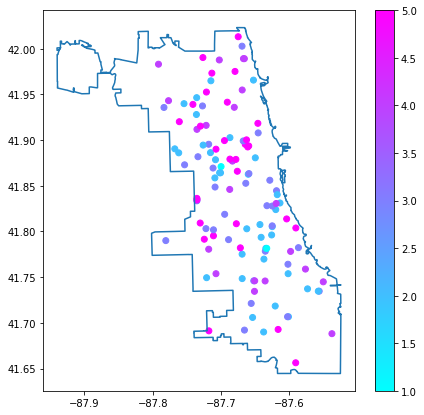


```python
#2.1.2 Counts of schools by survey safety levels
ax = data.groupby(['Safety_Level']).size().plot(kind='bar')
ax.set(xlabel="Safety Level", ylabel="Count")
```


    [<matplotlib.text.Text at 0x7f1937f9bac8>,
     <matplotlib.text.Text at 0x7f1938024be0>]


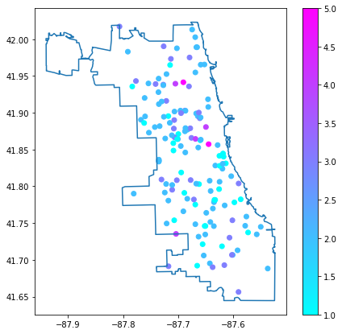


#### 2.2 Histograms for interval variables

Plot the counts of schools with different performance variables (ACT scores, Graduation rates and College enrollment percentages). All Y-axis are for the number of schools. Ten bins (default) are used for each plot.


```python
data.hist(column='ACT_Score', grid=False)
data.hist(column='Graduation_Pct', grid=False)
data.hist(column='College_Enrollment_Pct', grid=False)
data.hist(column='Total_Crimes', grid=False)
```


    array([[<matplotlib.axes._subplots.AxesSubplot object at 0x7f1937cb41d0>]], dtype=object)


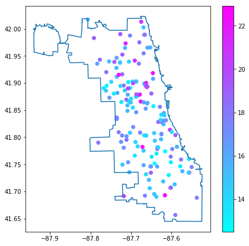


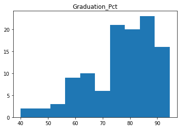


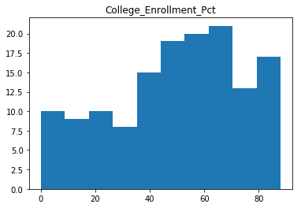


#### 2.3 Overview of crime data

How many criminal cases are within 0.5km of schools


```python
cases = pd.read_csv('data/school_crimes.csv')
cases['Crime_ID'].nunique()
```


    77863


Print the top ten schools with the smallest numbers of criminal cases (safest neighborhood)


```python
data.sort_values(['Total_Crimes'])[['Short_Name','Level','Safety_Level','Total_Crimes']].head(10)
```


<div>
<style>
    .dataframe thead tr:only-child th {
        text-align: right;
    }

    .dataframe thead th {
        text-align: left;
    }

    .dataframe tbody tr th {
        vertical-align: top;
    }
</style>
<table border="1" class="dataframe">
  <thead>
    <tr style="text-align: right;">
      <th></th>
      <th>Short_Name</th>
      <th>Level</th>
      <th>Safety_Level</th>
      <th>Total_Crimes</th>
    </tr>
  </thead>
  <tbody>
    <tr>
      <th>102</th>
      <td>OMBUDSMAN - NORTHWEST HS</td>
      <td>NaN</td>
      <td>3.0</td>
      <td>81.0</td>
    </tr>
    <tr>
      <th>56</th>
      <td>CHICAGO AGRICULTURE HS</td>
      <td>5.0</td>
      <td>3.0</td>
      <td>154.0</td>
    </tr>
    <tr>
      <th>16</th>
      <td>CICS - NORTHTOWN HS</td>
      <td>5.0</td>
      <td>3.0</td>
      <td>234.0</td>
    </tr>
    <tr>
      <th>49</th>
      <td>WASHINGTON HS</td>
      <td>4.0</td>
      <td>2.0</td>
      <td>279.0</td>
    </tr>
    <tr>
      <th>74</th>
      <td>SOCIAL JUSTICE HS</td>
      <td>3.0</td>
      <td>2.0</td>
      <td>285.0</td>
    </tr>
    <tr>
      <th>164</th>
      <td>PATHWAYS - ASHBURN HS</td>
      <td>NaN</td>
      <td>4.0</td>
      <td>332.0</td>
    </tr>
    <tr>
      <th>125</th>
      <td>TAFT HS</td>
      <td>4.0</td>
      <td>2.0</td>
      <td>345.0</td>
    </tr>
    <tr>
      <th>120</th>
      <td>WORLD LANGUAGE HS</td>
      <td>5.0</td>
      <td>2.0</td>
      <td>345.0</td>
    </tr>
    <tr>
      <th>115</th>
      <td>YCCS - OLIVE HARVEY</td>
      <td>NaN</td>
      <td>2.0</td>
      <td>350.0</td>
    </tr>
    <tr>
      <th>0</th>
      <td>MULTICULTURAL HS</td>
      <td>3.0</td>
      <td>2.0</td>
      <td>397.0</td>
    </tr>
  </tbody>
</table>
</div>


Print the top ten schools with the largest numbers of criminal cases (most dangerout neighborhood)


```python
data.sort_values(['Total_Crimes'], ascending=False)[['Short_Name','Level','Safety_Level','Total_Crimes']].head(10)
```


<div>
<style>
    .dataframe thead tr:only-child th {
        text-align: right;
    }

    .dataframe thead th {
        text-align: left;
    }

    .dataframe tbody tr th {
        vertical-align: top;
    }
</style>
<table border="1" class="dataframe">
  <thead>
    <tr style="text-align: right;">
      <th></th>
      <th>Short_Name</th>
      <th>Level</th>
      <th>Safety_Level</th>
      <th>Total_Crimes</th>
    </tr>
  </thead>
  <tbody>
    <tr>
      <th>108</th>
      <td>NOBLE - DRW HS</td>
      <td>3.0</td>
      <td>2.0</td>
      <td>4549.0</td>
    </tr>
    <tr>
      <th>112</th>
      <td>YCCS - CCA ACADEMY</td>
      <td>NaN</td>
      <td>2.0</td>
      <td>4536.0</td>
    </tr>
    <tr>
      <th>42</th>
      <td>YCCS - SCHOLASTIC ACHIEVEMENT</td>
      <td>NaN</td>
      <td>2.0</td>
      <td>4444.0</td>
    </tr>
    <tr>
      <th>97</th>
      <td>MAGIC JOHNSON - N LAWNDALE HS</td>
      <td>NaN</td>
      <td>3.0</td>
      <td>4177.0</td>
    </tr>
    <tr>
      <th>104</th>
      <td>AUSTIN CCA HS</td>
      <td>2.0</td>
      <td>1.0</td>
      <td>4173.0</td>
    </tr>
    <tr>
      <th>10</th>
      <td>NOBLE - ROWE CLARK HS</td>
      <td>3.0</td>
      <td>1.0</td>
      <td>4045.0</td>
    </tr>
    <tr>
      <th>33</th>
      <td>NORTH LAWNDALE - CHRISTIANA HS</td>
      <td>2.0</td>
      <td>1.0</td>
      <td>4009.0</td>
    </tr>
    <tr>
      <th>30</th>
      <td>LEGAL PREP HS</td>
      <td>3.0</td>
      <td>2.0</td>
      <td>3978.0</td>
    </tr>
    <tr>
      <th>155</th>
      <td>YCCS - AUSTIN CAREER</td>
      <td>NaN</td>
      <td>2.0</td>
      <td>3630.0</td>
    </tr>
    <tr>
      <th>6</th>
      <td>HIRSCH HS</td>
      <td>2.0</td>
      <td>3.0</td>
      <td>3362.0</td>
    </tr>
  </tbody>
</table>
</div>


** Visualize locations of schools on Chicago map. Colors represent the number of criminal cases in the neighborhood.**

The safety of school neighborhood displays a clustering pattern.


```python
chicago = pd.read_csv('data/chicago_boundary.csv')
#fig, ax = plt.subplots(1, 1, figsize=(40,40))
plt.figure(figsize=(7,7))
plt.plot('Longitude', 'Latitude', data=chicago.loc[0:11350])
plt.scatter(data.School_Longitude, data.School_Latitude, c=data.Total_Crimes, cmap=plt.cm.get_cmap('cool'))
plt.colorbar()
plt.show()
```


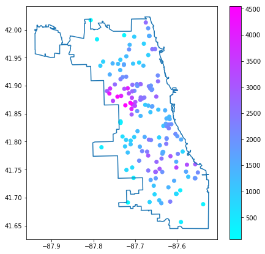


### 3 Regression for data correlation analysis

**Target variable (Performance variables):** Rating, ACT Score, Graduation rate, College Enrollment Percentage

**Predictors (Safety variables):** (1) Total crimes (2) Number of different types of crimes


```python
# Define functions for analysis for the rest

# Regression on the total crimes. Scatter and trend line will be plotted. Fitting results will be printed.
def OLS_by_total_crimes(data, target):
    # Try total crimes data
    subdata = data[[target, 'Total_Crimes']].dropna()

    # Plot regression
    sns.regplot(x = subdata['Total_Crimes'], y = subdata[target],
                scatter_kws = {"alpha" : 0.1, "color" : "grey"}, line_kws = {"color" : "blue"});

    # Print regression result
    ols = smf.ols(formula = target + " ~ Total_Crimes", data = subdata)
    model = ols.fit()
    return model

# Regression on different types of crimes. Only fitting results will be shown.
def OLS_by_crime_types(data, target):
    # Try categorized crime data
    subdata = data[[target, 
                    'Total_Thefts', 'Total_Batteries', 'Total_Assaults',
                    'Total_Robberies', 'Total_Weapon_Violations', 'Total_Homicides']].dropna()
    
    ols = smf.ols(formula = target + "~ Total_Thefts + Total_Batteries + Total_Assaults + Total_Robberies + Total_Weapon_Violations + Total_Homicides", data = subdata)
    model = ols.fit()
    return model
    
```

#### 3.1 Scatter matrix analysis using total crimes and performance variables.


```python
from pandas.plotting import scatter_matrix
scatter_matrix(data[['Total_Crimes','ACT_Score','Graduation_Pct','College_Enrollment_Pct']], alpha=0.5, figsize=(10, 10), diagonal='kde')
```


    array([[<matplotlib.axes._subplots.AxesSubplot object at 0x7f1937d86e10>,
            <matplotlib.axes._subplots.AxesSubplot object at 0x7f193811a828>,
            <matplotlib.axes._subplots.AxesSubplot object at 0x7f19375820f0>,
            <matplotlib.axes._subplots.AxesSubplot object at 0x7f193851feb8>],
           [<matplotlib.axes._subplots.AxesSubplot object at 0x7f193897cc18>,
            <matplotlib.axes._subplots.AxesSubplot object at 0x7f193897c9b0>,
            <matplotlib.axes._subplots.AxesSubplot object at 0x7f1941c18240>,
            <matplotlib.axes._subplots.AxesSubplot object at 0x7f1942a3bc18>],
           [<matplotlib.axes._subplots.AxesSubplot object at 0x7f19384b46a0>,
            <matplotlib.axes._subplots.AxesSubplot object at 0x7f1938282908>,
            <matplotlib.axes._subplots.AxesSubplot object at 0x7f1938dd6898>,
            <matplotlib.axes._subplots.AxesSubplot object at 0x7f193853d320>],
           [<matplotlib.axes._subplots.AxesSubplot object at 0x7f19388826d8>,
            <matplotlib.axes._subplots.AxesSubplot object at 0x7f1938dc1940>,
            <matplotlib.axes._subplots.AxesSubplot object at 0x7f1940a7cf98>,
            <matplotlib.axes._subplots.AxesSubplot object at 0x7f193ff8dcf8>]], dtype=object)


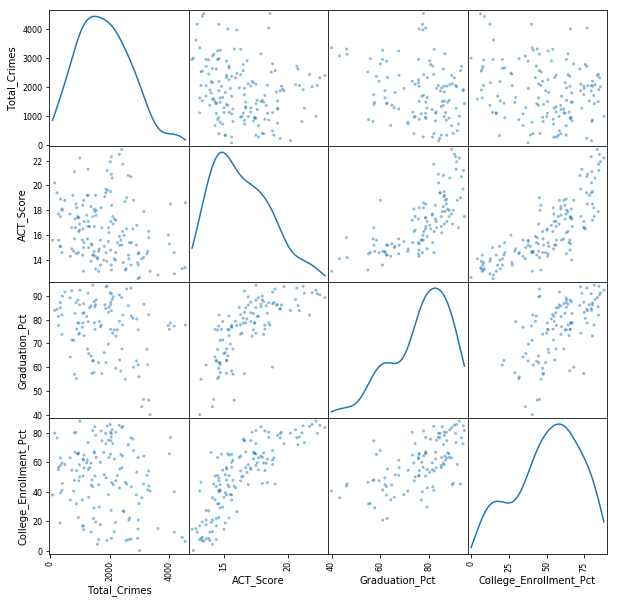


#### 3.2 Scatter plots of survey safety levels on different crimes


```python
data.plot(kind='scatter', x='Total_Crimes', y='Safety_Level')
data.plot(kind='scatter', x='Total_Robberies', y='Safety_Level')
data.plot(kind='scatter', x='Total_Weapon_Violations', y='Safety_Level')
data.plot(kind='scatter', x='Total_Homicides', y='Safety_Level')
```


    <matplotlib.axes._subplots.AxesSubplot at 0x7f1937baf198>


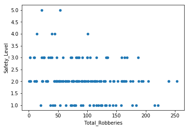


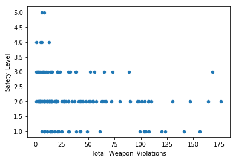


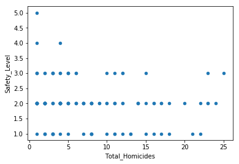


### 3.3 Regression on total crimes


```python
#3.3.1 Target variable: Rating (Level)
OLS_by_total_crimes(data, 'Level').summary()
```


<table class="simpletable">
<caption>OLS Regression Results</caption>
<tr>
  <th>Dep. Variable:</th>          <td>Level</td>      <th>  R-squared:         </th> <td>   0.075</td>
</tr>
<tr>
  <th>Model:</th>                   <td>OLS</td>       <th>  Adj. R-squared:    </th> <td>   0.068</td>
</tr>
<tr>
  <th>Method:</th>             <td>Least Squares</td>  <th>  F-statistic:       </th> <td>   9.799</td>
</tr>
<tr>
  <th>Date:</th>             <td>Thu, 30 Nov 2017</td> <th>  Prob (F-statistic):</th>  <td>0.00219</td>
</tr>
<tr>
  <th>Time:</th>                 <td>22:26:59</td>     <th>  Log-Likelihood:    </th> <td> -189.92</td>
</tr>
<tr>
  <th>No. Observations:</th>      <td>   122</td>      <th>  AIC:               </th> <td>   383.8</td>
</tr>
<tr>
  <th>Df Residuals:</th>          <td>   120</td>      <th>  BIC:               </th> <td>   389.5</td>
</tr>
<tr>
  <th>Df Model:</th>              <td>     1</td>      <th>                     </th>     <td> </td>   
</tr>
<tr>
  <th>Covariance Type:</th>      <td>nonrobust</td>    <th>                     </th>     <td> </td>   
</tr>
</table>
<table class="simpletable">
<tr>
        <td></td>          <th>coef</th>     <th>std err</th>      <th>t</th>      <th>P>|t|</th>  <th>[0.025</th>    <th>0.975]</th>  
</tr>
<tr>
  <th>Intercept</th>    <td>    3.9778</td> <td>    0.226</td> <td>   17.633</td> <td> 0.000</td> <td>    3.531</td> <td>    4.424</td>
</tr>
<tr>
  <th>Total_Crimes</th> <td>   -0.0003</td> <td>    0.000</td> <td>   -3.130</td> <td> 0.002</td> <td>   -0.001</td> <td>   -0.000</td>
</tr>
</table>
<table class="simpletable">
<tr>
  <th>Omnibus:</th>       <td>47.490</td> <th>  Durbin-Watson:     </th> <td>   2.260</td>
</tr>
<tr>
  <th>Prob(Omnibus):</th> <td> 0.000</td> <th>  Jarque-Bera (JB):  </th> <td>   7.798</td>
</tr>
<tr>
  <th>Skew:</th>          <td> 0.136</td> <th>  Prob(JB):          </th> <td>  0.0203</td>
</tr>
<tr>
  <th>Kurtosis:</th>      <td> 1.791</td> <th>  Cond. No.          </th> <td>4.37e+03</td>
</tr>
</table>


```python
#3.3.2 Target variable: Survey safety level
OLS_by_total_crimes(data, 'Safety_Level').summary()
```


<table class="simpletable">
<caption>OLS Regression Results</caption>
<tr>
  <th>Dep. Variable:</th>      <td>Safety_Level</td>   <th>  R-squared:         </th> <td>   0.037</td>
</tr>
<tr>
  <th>Model:</th>                   <td>OLS</td>       <th>  Adj. R-squared:    </th> <td>   0.031</td>
</tr>
<tr>
  <th>Method:</th>             <td>Least Squares</td>  <th>  F-statistic:       </th> <td>   5.636</td>
</tr>
<tr>
  <th>Date:</th>             <td>Thu, 30 Nov 2017</td> <th>  Prob (F-statistic):</th>  <td>0.0189</td> 
</tr>
<tr>
  <th>Time:</th>                 <td>22:26:59</td>     <th>  Log-Likelihood:    </th> <td> -173.20</td>
</tr>
<tr>
  <th>No. Observations:</th>      <td>   148</td>      <th>  AIC:               </th> <td>   350.4</td>
</tr>
<tr>
  <th>Df Residuals:</th>          <td>   146</td>      <th>  BIC:               </th> <td>   356.4</td>
</tr>
<tr>
  <th>Df Model:</th>              <td>     1</td>      <th>                     </th>     <td> </td>   
</tr>
<tr>
  <th>Covariance Type:</th>      <td>nonrobust</td>    <th>                     </th>     <td> </td>   
</tr>
</table>
<table class="simpletable">
<tr>
        <td></td>          <th>coef</th>     <th>std err</th>      <th>t</th>      <th>P>|t|</th>  <th>[0.025</th>    <th>0.975]</th>  
</tr>
<tr>
  <th>Intercept</th>    <td>    2.3852</td> <td>    0.136</td> <td>   17.553</td> <td> 0.000</td> <td>    2.117</td> <td>    2.654</td>
</tr>
<tr>
  <th>Total_Crimes</th> <td>   -0.0002</td> <td> 6.45e-05</td> <td>   -2.374</td> <td> 0.019</td> <td>   -0.000</td> <td>-2.57e-05</td>
</tr>
</table>
<table class="simpletable">
<tr>
  <th>Omnibus:</th>       <td>16.538</td> <th>  Durbin-Watson:     </th> <td>   1.911</td>
</tr>
<tr>
  <th>Prob(Omnibus):</th> <td> 0.000</td> <th>  Jarque-Bera (JB):  </th> <td>  20.250</td>
</tr>
<tr>
  <th>Skew:</th>          <td> 0.701</td> <th>  Prob(JB):          </th> <td>4.01e-05</td>
</tr>
<tr>
  <th>Kurtosis:</th>      <td> 4.148</td> <th>  Cond. No.          </th> <td>4.43e+03</td>
</tr>
</table>


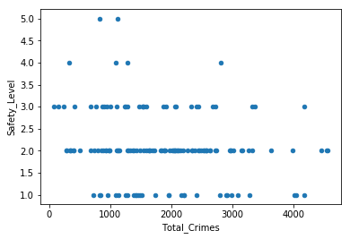


```python
#3.3.3 Target variable: ACT score
OLS_by_total_crimes(data, 'ACT_Score').summary()
```


<table class="simpletable">
<caption>OLS Regression Results</caption>
<tr>
  <th>Dep. Variable:</th>        <td>ACT_Score</td>    <th>  R-squared:         </th> <td>   0.050</td>
</tr>
<tr>
  <th>Model:</th>                   <td>OLS</td>       <th>  Adj. R-squared:    </th> <td>   0.043</td>
</tr>
<tr>
  <th>Method:</th>             <td>Least Squares</td>  <th>  F-statistic:       </th> <td>   8.023</td>
</tr>
<tr>
  <th>Date:</th>             <td>Thu, 30 Nov 2017</td> <th>  Prob (F-statistic):</th>  <td>0.00524</td>
</tr>
<tr>
  <th>Time:</th>                 <td>22:27:00</td>     <th>  Log-Likelihood:    </th> <td> -354.04</td>
</tr>
<tr>
  <th>No. Observations:</th>      <td>   156</td>      <th>  AIC:               </th> <td>   712.1</td>
</tr>
<tr>
  <th>Df Residuals:</th>          <td>   154</td>      <th>  BIC:               </th> <td>   718.2</td>
</tr>
<tr>
  <th>Df Model:</th>              <td>     1</td>      <th>                     </th>     <td> </td>   
</tr>
<tr>
  <th>Covariance Type:</th>      <td>nonrobust</td>    <th>                     </th>     <td> </td>   
</tr>
</table>
<table class="simpletable">
<tr>
        <td></td>          <th>coef</th>     <th>std err</th>      <th>t</th>      <th>P>|t|</th>  <th>[0.025</th>    <th>0.975]</th>  
</tr>
<tr>
  <th>Intercept</th>    <td>   17.4805</td> <td>    0.405</td> <td>   43.140</td> <td> 0.000</td> <td>   16.680</td> <td>   18.281</td>
</tr>
<tr>
  <th>Total_Crimes</th> <td>   -0.0005</td> <td>    0.000</td> <td>   -2.832</td> <td> 0.005</td> <td>   -0.001</td> <td>   -0.000</td>
</tr>
</table>
<table class="simpletable">
<tr>
  <th>Omnibus:</th>       <td>13.290</td> <th>  Durbin-Watson:     </th> <td>   2.163</td>
</tr>
<tr>
  <th>Prob(Omnibus):</th> <td> 0.001</td> <th>  Jarque-Bera (JB):  </th> <td>  14.901</td>
</tr>
<tr>
  <th>Skew:</th>          <td> 0.757</td> <th>  Prob(JB):          </th> <td>0.000581</td>
</tr>
<tr>
  <th>Kurtosis:</th>      <td> 2.957</td> <th>  Cond. No.          </th> <td>4.53e+03</td>
</tr>
</table>


```python
#3.3.4 Target variable: Graduation rate
OLS_by_total_crimes(data, 'Graduation_Pct').summary()
```


<table class="simpletable">
<caption>OLS Regression Results</caption>
<tr>
  <th>Dep. Variable:</th>     <td>Graduation_Pct</td>  <th>  R-squared:         </th> <td>   0.069</td>
</tr>
<tr>
  <th>Model:</th>                   <td>OLS</td>       <th>  Adj. R-squared:    </th> <td>   0.061</td>
</tr>
<tr>
  <th>Method:</th>             <td>Least Squares</td>  <th>  F-statistic:       </th> <td>   8.167</td>
</tr>
<tr>
  <th>Date:</th>             <td>Thu, 30 Nov 2017</td> <th>  Prob (F-statistic):</th>  <td>0.00510</td>
</tr>
<tr>
  <th>Time:</th>                 <td>22:27:00</td>     <th>  Log-Likelihood:    </th> <td> -435.64</td>
</tr>
<tr>
  <th>No. Observations:</th>      <td>   112</td>      <th>  AIC:               </th> <td>   875.3</td>
</tr>
<tr>
  <th>Df Residuals:</th>          <td>   110</td>      <th>  BIC:               </th> <td>   880.7</td>
</tr>
<tr>
  <th>Df Model:</th>              <td>     1</td>      <th>                     </th>     <td> </td>   
</tr>
<tr>
  <th>Covariance Type:</th>      <td>nonrobust</td>    <th>                     </th>     <td> </td>   
</tr>
</table>
<table class="simpletable">
<tr>
        <td></td>          <th>coef</th>     <th>std err</th>      <th>t</th>      <th>P>|t|</th>  <th>[0.025</th>    <th>0.975]</th>  
</tr>
<tr>
  <th>Intercept</th>    <td>   82.6642</td> <td>    2.413</td> <td>   34.257</td> <td> 0.000</td> <td>   77.882</td> <td>   87.446</td>
</tr>
<tr>
  <th>Total_Crimes</th> <td>   -0.0034</td> <td>    0.001</td> <td>   -2.858</td> <td> 0.005</td> <td>   -0.006</td> <td>   -0.001</td>
</tr>
</table>
<table class="simpletable">
<tr>
  <th>Omnibus:</th>       <td> 7.783</td> <th>  Durbin-Watson:     </th> <td>   2.148</td>
</tr>
<tr>
  <th>Prob(Omnibus):</th> <td> 0.020</td> <th>  Jarque-Bera (JB):  </th> <td>   7.963</td>
</tr>
<tr>
  <th>Skew:</th>          <td>-0.617</td> <th>  Prob(JB):          </th> <td>  0.0187</td>
</tr>
<tr>
  <th>Kurtosis:</th>      <td> 2.572</td> <th>  Cond. No.          </th> <td>4.40e+03</td>
</tr>
</table>


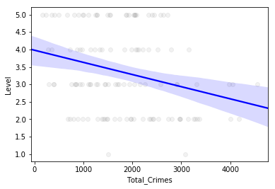


```python
#3.3.5 Target variable: College enrollment percentage
OLS_by_total_crimes(data, 'College_Enrollment_Pct').summary()
```


<table class="simpletable">
<caption>OLS Regression Results</caption>
<tr>
  <th>Dep. Variable:</th>    <td>College_Enrollment_Pct</td> <th>  R-squared:         </th> <td>   0.043</td>
</tr>
<tr>
  <th>Model:</th>                      <td>OLS</td>          <th>  Adj. R-squared:    </th> <td>   0.036</td>
</tr>
<tr>
  <th>Method:</th>                <td>Least Squares</td>     <th>  F-statistic:       </th> <td>   6.216</td>
</tr>
<tr>
  <th>Date:</th>                <td>Thu, 30 Nov 2017</td>    <th>  Prob (F-statistic):</th>  <td>0.0138</td> 
</tr>
<tr>
  <th>Time:</th>                    <td>22:27:01</td>        <th>  Log-Likelihood:    </th> <td> -644.82</td>
</tr>
<tr>
  <th>No. Observations:</th>         <td>   142</td>         <th>  AIC:               </th> <td>   1294.</td>
</tr>
<tr>
  <th>Df Residuals:</th>             <td>   140</td>         <th>  BIC:               </th> <td>   1300.</td>
</tr>
<tr>
  <th>Df Model:</th>                 <td>     1</td>         <th>                     </th>     <td> </td>   
</tr>
<tr>
  <th>Covariance Type:</th>         <td>nonrobust</td>       <th>                     </th>     <td> </td>   
</tr>
</table>
<table class="simpletable">
<tr>
        <td></td>          <th>coef</th>     <th>std err</th>      <th>t</th>      <th>P>|t|</th>  <th>[0.025</th>    <th>0.975]</th>  
</tr>
<tr>
  <th>Intercept</th>    <td>   58.7437</td> <td>    4.160</td> <td>   14.120</td> <td> 0.000</td> <td>   50.519</td> <td>   66.969</td>
</tr>
<tr>
  <th>Total_Crimes</th> <td>   -0.0049</td> <td>    0.002</td> <td>   -2.493</td> <td> 0.014</td> <td>   -0.009</td> <td>   -0.001</td>
</tr>
</table>
<table class="simpletable">
<tr>
  <th>Omnibus:</th>       <td>16.648</td> <th>  Durbin-Watson:     </th> <td>   2.111</td>
</tr>
<tr>
  <th>Prob(Omnibus):</th> <td> 0.000</td> <th>  Jarque-Bera (JB):  </th> <td>   6.239</td>
</tr>
<tr>
  <th>Skew:</th>          <td>-0.232</td> <th>  Prob(JB):          </th> <td>  0.0442</td>
</tr>
<tr>
  <th>Kurtosis:</th>      <td> 2.084</td> <th>  Cond. No.          </th> <td>4.55e+03</td>
</tr>
</table>


#### 3.4 Multivariable regressions on different variables


```python
#3.4.1 Target variable: Rating (Level)
OLS_by_crime_types(data, 'Level').summary()
```


<table class="simpletable">
<caption>OLS Regression Results</caption>
<tr>
  <th>Dep. Variable:</th>          <td>Level</td>      <th>  R-squared:         </th> <td>   0.150</td>
</tr>
<tr>
  <th>Model:</th>                   <td>OLS</td>       <th>  Adj. R-squared:    </th> <td>   0.095</td>
</tr>
<tr>
  <th>Method:</th>             <td>Least Squares</td>  <th>  F-statistic:       </th> <td>   2.726</td>
</tr>
<tr>
  <th>Date:</th>             <td>Thu, 30 Nov 2017</td> <th>  Prob (F-statistic):</th>  <td>0.0175</td> 
</tr>
<tr>
  <th>Time:</th>                 <td>22:27:01</td>     <th>  Log-Likelihood:    </th> <td> -152.80</td>
</tr>
<tr>
  <th>No. Observations:</th>      <td>   100</td>      <th>  AIC:               </th> <td>   319.6</td>
</tr>
<tr>
  <th>Df Residuals:</th>          <td>    93</td>      <th>  BIC:               </th> <td>   337.8</td>
</tr>
<tr>
  <th>Df Model:</th>              <td>     6</td>      <th>                     </th>     <td> </td>   
</tr>
<tr>
  <th>Covariance Type:</th>      <td>nonrobust</td>    <th>                     </th>     <td> </td>   
</tr>
</table>
<table class="simpletable">
<tr>
             <td></td>                <th>coef</th>     <th>std err</th>      <th>t</th>      <th>P>|t|</th>  <th>[0.025</th>    <th>0.975]</th>  
</tr>
<tr>
  <th>Intercept</th>               <td>    3.7039</td> <td>    0.335</td> <td>   11.043</td> <td> 0.000</td> <td>    3.038</td> <td>    4.370</td>
</tr>
<tr>
  <th>Total_Thefts</th>            <td> 5.327e-05</td> <td>    0.001</td> <td>    0.084</td> <td> 0.934</td> <td>   -0.001</td> <td>    0.001</td>
</tr>
<tr>
  <th>Total_Batteries</th>         <td>   -0.0040</td> <td>    0.003</td> <td>   -1.567</td> <td> 0.120</td> <td>   -0.009</td> <td>    0.001</td>
</tr>
<tr>
  <th>Total_Assaults</th>          <td>    0.0044</td> <td>    0.006</td> <td>    0.685</td> <td> 0.495</td> <td>   -0.008</td> <td>    0.017</td>
</tr>
<tr>
  <th>Total_Robberies</th>         <td>    0.0057</td> <td>    0.005</td> <td>    1.228</td> <td> 0.222</td> <td>   -0.003</td> <td>    0.015</td>
</tr>
<tr>
  <th>Total_Weapon_Violations</th> <td>    0.0005</td> <td>    0.008</td> <td>    0.062</td> <td> 0.951</td> <td>   -0.016</td> <td>    0.017</td>
</tr>
<tr>
  <th>Total_Homicides</th>         <td>   -0.0165</td> <td>    0.038</td> <td>   -0.432</td> <td> 0.666</td> <td>   -0.092</td> <td>    0.059</td>
</tr>
</table>
<table class="simpletable">
<tr>
  <th>Omnibus:</th>       <td>16.507</td> <th>  Durbin-Watson:     </th> <td>   2.166</td>
</tr>
<tr>
  <th>Prob(Omnibus):</th> <td> 0.000</td> <th>  Jarque-Bera (JB):  </th> <td>   4.600</td>
</tr>
<tr>
  <th>Skew:</th>          <td> 0.083</td> <th>  Prob(JB):          </th> <td>   0.100</td>
</tr>
<tr>
  <th>Kurtosis:</th>      <td> 1.962</td> <th>  Cond. No.          </th> <td>1.93e+03</td>
</tr>
</table>


```python
#3.4.2 Target variable: ACT Score
OLS_by_crime_types(data, 'ACT_Score').summary()
```


<table class="simpletable">
<caption>OLS Regression Results</caption>
<tr>
  <th>Dep. Variable:</th>        <td>ACT_Score</td>    <th>  R-squared:         </th> <td>   0.165</td>
</tr>
<tr>
  <th>Model:</th>                   <td>OLS</td>       <th>  Adj. R-squared:    </th> <td>   0.125</td>
</tr>
<tr>
  <th>Method:</th>             <td>Least Squares</td>  <th>  F-statistic:       </th> <td>   4.096</td>
</tr>
<tr>
  <th>Date:</th>             <td>Thu, 30 Nov 2017</td> <th>  Prob (F-statistic):</th> <td>0.000875</td>
</tr>
<tr>
  <th>Time:</th>                 <td>22:27:01</td>     <th>  Log-Likelihood:    </th> <td> -287.35</td>
</tr>
<tr>
  <th>No. Observations:</th>      <td>   131</td>      <th>  AIC:               </th> <td>   588.7</td>
</tr>
<tr>
  <th>Df Residuals:</th>          <td>   124</td>      <th>  BIC:               </th> <td>   608.8</td>
</tr>
<tr>
  <th>Df Model:</th>              <td>     6</td>      <th>                     </th>     <td> </td>   
</tr>
<tr>
  <th>Covariance Type:</th>      <td>nonrobust</td>    <th>                     </th>     <td> </td>   
</tr>
</table>
<table class="simpletable">
<tr>
             <td></td>                <th>coef</th>     <th>std err</th>      <th>t</th>      <th>P>|t|</th>  <th>[0.025</th>    <th>0.975]</th>  
</tr>
<tr>
  <th>Intercept</th>               <td>   16.3955</td> <td>    0.578</td> <td>   28.347</td> <td> 0.000</td> <td>   15.251</td> <td>   17.540</td>
</tr>
<tr>
  <th>Total_Thefts</th>            <td>    0.0021</td> <td>    0.001</td> <td>    1.862</td> <td> 0.065</td> <td>   -0.000</td> <td>    0.004</td>
</tr>
<tr>
  <th>Total_Batteries</th>         <td>   -0.0098</td> <td>    0.004</td> <td>   -2.216</td> <td> 0.029</td> <td>   -0.019</td> <td>   -0.001</td>
</tr>
<tr>
  <th>Total_Assaults</th>          <td>    0.0178</td> <td>    0.011</td> <td>    1.603</td> <td> 0.112</td> <td>   -0.004</td> <td>    0.040</td>
</tr>
<tr>
  <th>Total_Robberies</th>         <td>    0.0012</td> <td>    0.008</td> <td>    0.160</td> <td> 0.873</td> <td>   -0.014</td> <td>    0.017</td>
</tr>
<tr>
  <th>Total_Weapon_Violations</th> <td>    0.0024</td> <td>    0.013</td> <td>    0.175</td> <td> 0.861</td> <td>   -0.024</td> <td>    0.029</td>
</tr>
<tr>
  <th>Total_Homicides</th>         <td>    0.0036</td> <td>    0.065</td> <td>    0.056</td> <td> 0.956</td> <td>   -0.125</td> <td>    0.132</td>
</tr>
</table>
<table class="simpletable">
<tr>
  <th>Omnibus:</th>       <td>11.826</td> <th>  Durbin-Watson:     </th> <td>   2.185</td>
</tr>
<tr>
  <th>Prob(Omnibus):</th> <td> 0.003</td> <th>  Jarque-Bera (JB):  </th> <td>  12.613</td>
</tr>
<tr>
  <th>Skew:</th>          <td> 0.753</td> <th>  Prob(JB):          </th> <td> 0.00182</td>
</tr>
<tr>
  <th>Kurtosis:</th>      <td> 3.204</td> <th>  Cond. No.          </th> <td>2.02e+03</td>
</tr>
</table>


```python
#3.4.3 Target variable: Graduation rate
OLS_by_crime_types(data, 'Graduation_Pct').summary()
```


<table class="simpletable">
<caption>OLS Regression Results</caption>
<tr>
  <th>Dep. Variable:</th>     <td>Graduation_Pct</td>  <th>  R-squared:         </th> <td>   0.162</td>
</tr>
<tr>
  <th>Model:</th>                   <td>OLS</td>       <th>  Adj. R-squared:    </th> <td>   0.103</td>
</tr>
<tr>
  <th>Method:</th>             <td>Least Squares</td>  <th>  F-statistic:       </th> <td>   2.749</td>
</tr>
<tr>
  <th>Date:</th>             <td>Thu, 30 Nov 2017</td> <th>  Prob (F-statistic):</th>  <td>0.0172</td> 
</tr>
<tr>
  <th>Time:</th>                 <td>22:27:01</td>     <th>  Log-Likelihood:    </th> <td> -356.51</td>
</tr>
<tr>
  <th>No. Observations:</th>      <td>    92</td>      <th>  AIC:               </th> <td>   727.0</td>
</tr>
<tr>
  <th>Df Residuals:</th>          <td>    85</td>      <th>  BIC:               </th> <td>   744.7</td>
</tr>
<tr>
  <th>Df Model:</th>              <td>     6</td>      <th>                     </th>     <td> </td>   
</tr>
<tr>
  <th>Covariance Type:</th>      <td>nonrobust</td>    <th>                     </th>     <td> </td>   
</tr>
</table>
<table class="simpletable">
<tr>
             <td></td>                <th>coef</th>     <th>std err</th>      <th>t</th>      <th>P>|t|</th>  <th>[0.025</th>    <th>0.975]</th>  
</tr>
<tr>
  <th>Intercept</th>               <td>   82.9635</td> <td>    3.652</td> <td>   22.714</td> <td> 0.000</td> <td>   75.701</td> <td>   90.226</td>
</tr>
<tr>
  <th>Total_Thefts</th>            <td>    0.0019</td> <td>    0.008</td> <td>    0.245</td> <td> 0.807</td> <td>   -0.013</td> <td>    0.017</td>
</tr>
<tr>
  <th>Total_Batteries</th>         <td>   -0.0289</td> <td>    0.028</td> <td>   -1.041</td> <td> 0.301</td> <td>   -0.084</td> <td>    0.026</td>
</tr>
<tr>
  <th>Total_Assaults</th>          <td>   -0.0025</td> <td>    0.068</td> <td>   -0.036</td> <td> 0.971</td> <td>   -0.139</td> <td>    0.134</td>
</tr>
<tr>
  <th>Total_Robberies</th>         <td>    0.0484</td> <td>    0.053</td> <td>    0.913</td> <td> 0.364</td> <td>   -0.057</td> <td>    0.154</td>
</tr>
<tr>
  <th>Total_Weapon_Violations</th> <td>    0.1191</td> <td>    0.090</td> <td>    1.321</td> <td> 0.190</td> <td>   -0.060</td> <td>    0.298</td>
</tr>
<tr>
  <th>Total_Homicides</th>         <td>   -0.7393</td> <td>    0.424</td> <td>   -1.746</td> <td> 0.085</td> <td>   -1.581</td> <td>    0.103</td>
</tr>
</table>
<table class="simpletable">
<tr>
  <th>Omnibus:</th>       <td> 5.687</td> <th>  Durbin-Watson:     </th> <td>   2.220</td>
</tr>
<tr>
  <th>Prob(Omnibus):</th> <td> 0.058</td> <th>  Jarque-Bera (JB):  </th> <td>   5.167</td>
</tr>
<tr>
  <th>Skew:</th>          <td>-0.506</td> <th>  Prob(JB):          </th> <td>  0.0755</td>
</tr>
<tr>
  <th>Kurtosis:</th>      <td> 2.433</td> <th>  Cond. No.          </th> <td>1.93e+03</td>
</tr>
</table>


```python
#3.4.4 Target variable: College enrollment percentage
OLS_by_crime_types(data, 'College_Enrollment_Pct').summary()
```


<table class="simpletable">
<caption>OLS Regression Results</caption>
<tr>
  <th>Dep. Variable:</th>    <td>College_Enrollment_Pct</td> <th>  R-squared:         </th> <td>   0.169</td>
</tr>
<tr>
  <th>Model:</th>                      <td>OLS</td>          <th>  Adj. R-squared:    </th> <td>   0.124</td>
</tr>
<tr>
  <th>Method:</th>                <td>Least Squares</td>     <th>  F-statistic:       </th> <td>   3.750</td>
</tr>
<tr>
  <th>Date:</th>                <td>Thu, 30 Nov 2017</td>    <th>  Prob (F-statistic):</th>  <td>0.00195</td>
</tr>
<tr>
  <th>Time:</th>                    <td>22:27:01</td>        <th>  Log-Likelihood:    </th> <td> -531.16</td>
</tr>
<tr>
  <th>No. Observations:</th>         <td>   118</td>         <th>  AIC:               </th> <td>   1076.</td>
</tr>
<tr>
  <th>Df Residuals:</th>             <td>   111</td>         <th>  BIC:               </th> <td>   1096.</td>
</tr>
<tr>
  <th>Df Model:</th>                 <td>     6</td>         <th>                     </th>     <td> </td>   
</tr>
<tr>
  <th>Covariance Type:</th>         <td>nonrobust</td>       <th>                     </th>     <td> </td>   
</tr>
</table>
<table class="simpletable">
<tr>
             <td></td>                <th>coef</th>     <th>std err</th>      <th>t</th>      <th>P>|t|</th>  <th>[0.025</th>    <th>0.975]</th>  
</tr>
<tr>
  <th>Intercept</th>               <td>   49.7486</td> <td>    6.235</td> <td>    7.978</td> <td> 0.000</td> <td>   37.393</td> <td>   62.104</td>
</tr>
<tr>
  <th>Total_Thefts</th>            <td>    0.0277</td> <td>    0.013</td> <td>    2.093</td> <td> 0.039</td> <td>    0.001</td> <td>    0.054</td>
</tr>
<tr>
  <th>Total_Batteries</th>         <td>   -0.1129</td> <td>    0.046</td> <td>   -2.478</td> <td> 0.015</td> <td>   -0.203</td> <td>   -0.023</td>
</tr>
<tr>
  <th>Total_Assaults</th>          <td>    0.2278</td> <td>    0.115</td> <td>    1.987</td> <td> 0.049</td> <td>    0.001</td> <td>    0.455</td>
</tr>
<tr>
  <th>Total_Robberies</th>         <td>   -0.0710</td> <td>    0.088</td> <td>   -0.809</td> <td> 0.420</td> <td>   -0.245</td> <td>    0.103</td>
</tr>
<tr>
  <th>Total_Weapon_Violations</th> <td>    0.1251</td> <td>    0.140</td> <td>    0.894</td> <td> 0.373</td> <td>   -0.152</td> <td>    0.402</td>
</tr>
<tr>
  <th>Total_Homicides</th>         <td>    0.0288</td> <td>    0.695</td> <td>    0.041</td> <td> 0.967</td> <td>   -1.348</td> <td>    1.406</td>
</tr>
</table>
<table class="simpletable">
<tr>
  <th>Omnibus:</th>       <td> 9.860</td> <th>  Durbin-Watson:     </th> <td>   1.973</td>
</tr>
<tr>
  <th>Prob(Omnibus):</th> <td> 0.007</td> <th>  Jarque-Bera (JB):  </th> <td>   4.339</td>
</tr>
<tr>
  <th>Skew:</th>          <td>-0.201</td> <th>  Prob(JB):          </th> <td>   0.114</td>
</tr>
<tr>
  <th>Kurtosis:</th>      <td> 2.151</td> <th>  Cond. No.          </th> <td>2.05e+03</td>
</tr>
</table>


